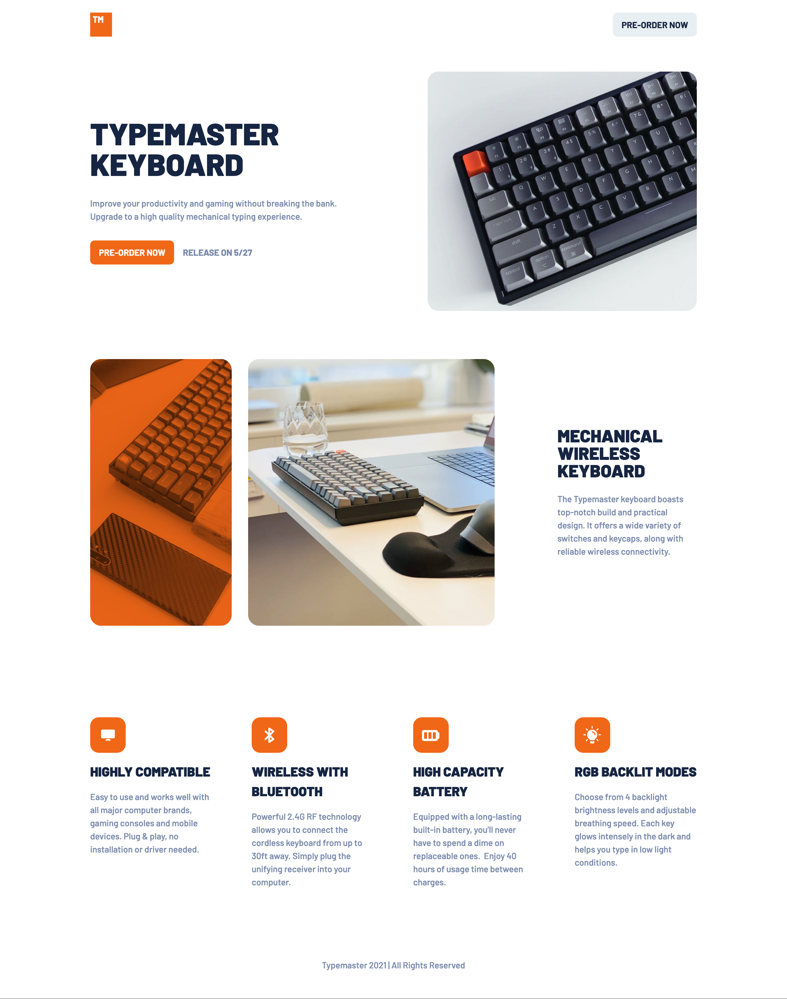
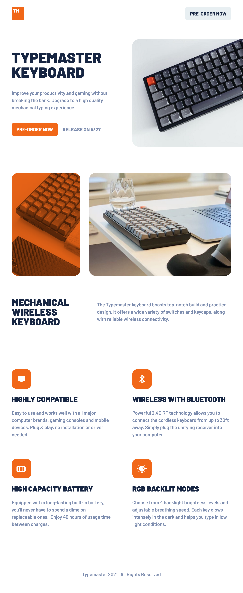
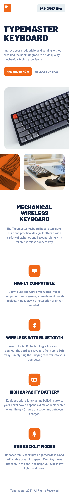

# Frontend Mentor - Typemaster pre-launch landing page solution

## Table of contents

- [Frontend Mentor - Typemaster pre-launch landing page solution](#frontend-mentor---typemaster-pre-launch-landing-page-solution)
  - [Table of contents](#table-of-contents)
    - [Screenshot](#screenshot)
    - [Links](#links)
  - [My process](#my-process)
    - [Built with](#built-with)
  - [Author](#author)

### Screenshot

### Links

- Solution URL: [https://github.com/jeancarlosruiz/TypeMaster-Web](https://github.com/jeancarlosruiz/TypeMaster-Web)
- Live Site URL: [https://jeancarlosruiz.github.io/TypeMaster-Web/](https://jeancarlosruiz.github.io/TypeMaster-Web/)

## My process

### Built with

- Semantic HTML5 markup
- CSS custom properties
- Flexbox
- CSS Grid
- SASS
- Mobile-first workflow
- VITE

## Author

- Website - [Jean Carlos Ruiz](https://www.your-site.com)
- Frontend Mentor - [@jeancarlosruiz](https://www.frontendmentor.io/profile/jeancarlosruiz)
